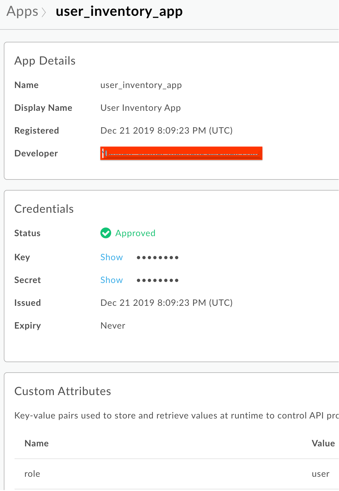

# Apigee with Open Policy Agent (OPA)

Use Open Policy Agent with Apigee hybrid to perform API Authorization. Learn more about Open Policy Agent [here](http://openpolicyagent.org/) and about Apigee hybrid [here](https://docs.apigee.com/hybrid).

## Sample Scenario

An [inventory service](https://github.com/srinandan/sample-apps/tree/master/inventory) is deployed in your Kubernetes cluster. You want to allow users with role `admin` access to HTTP methods `GET` and `POST` (i.e., get, list and create). However, users with role `user` only have access to the HTTP method GET (i.e., get and list)

In this scenario, OPA is a Policy Decision Point (also known as a PDP which is a component or rules engine that returns true | false based on a set of inputs applied on a rule) and the Apigee hybrid gateway is a Policy Enforcement Point (also known as a PEP which is a component or process that enforces decisions made by a PDP)

### Implementation Steps

#### Step 1

Create a file called policy.rego. This policy define two roles and authorizes each role to a set of http methods. The role is conveyed to the rules engine in a JWT claim

```

package httpapi.authz

# HTTP API request
import input

# Define admin permissions
admin_roles = ["admin", ]
admin_methods = ["GET", "POST", ]

# Define user permissions
user_roles = ["admin","user", ]
user_methods = ["GET", ]

default allow = false

# Allow any app to get inventory
allow {
  input.method == user_methods[_]
  input.path = ["/opa/items"]
  token.payload.role == user_roles[_]
}

# Allow only admin apps to create inventory
allow {
  input.method == admin_methods[_]
  input.path = ["/opa/items"]
  token.payload.role == admin_roles[_]
}

# Helper to get the token payload.
token = {"payload": payload} {
  [header, payload, signature] := io.jwt.decode(input.token)
}
```

#### Step 2

Deploy OPA server to Kubernetes [manifest](./open-policy-agent.yaml)

```bash

kubectl apply -f open-policy-agent.yaml -n apps
```

#### Step 3

Deploy a [token generation](./token-service) API proxy to Apigee hyrid

#### Step 4

Deploy the sample [inventory](./sample-service) API proxy to Apigee hyrid

#### Step 5

Create developer applications with a custom attribute called `role`. Set the user role on the app


NOTE: Typically the user role is defined in the IdP. This example does not use an IdP.